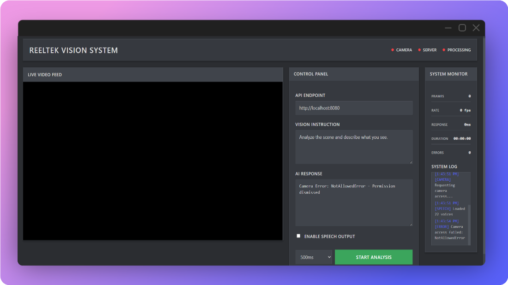

# ReelTek Vision System


This repo showcases the `ReelTek Vision System`,  real-time camera analysis platform utilizing local vision-language models with `llama.cpp` server scene understanding. ReelTek uses `SmolVLM` and `TTS` to provide realtime insights from your webcam feed



- EXAMPLE: 


## Features

- Real-time video analysis and object detection using webcam feed
- Integration with lightweight vision-language models for efficient processing
- Modern, user-friendly web interface with video display and control panels
- Customizable analysis instructions for tailored output
- System metrics monitoring for performance optimization
- **Speech synthesis support** - Hear the AI's analysis spoken aloud
  - Browser-based TTS with multiple voice options
  - Optional Python TTS server for enhanced voice quality

## Prerequisites

- A webcam connected to your computer
- A modern web browser (e.g., Chrome, Firefox)
- GPU support (optional but recommended for better performance) with NVidia, AMD, or Intel GPU

## How to Setup

1. **Install llama.cpp**:
   - Download and install `llama.cpp` from the official repository: [llama.cpp GitHub](https://github.com/ggml-org/llama.cpp).
   - Follow the installation instructions specific to your operating system (Windows, macOS, Linux).

2. **Run the llama.cpp Server**:
   - Open a terminal or command prompt.
   - Execute the following command to start the server with the SmolVLM model:
     ```bash
     llama-server -hf ggml-org/SmolVLM-500M-Instruct-GGUF
     ```
   - OR 
    ```bash
     .\llama-b5538-bin-win-cuda-12.4-x64\llama-server.exe -hf ggml-org/SmolVLM-500M-Instruct-GGUF -ngl 99
     ```


   - **Note for GPU Users**: the `-ngl 99` flag like the above is necessary to enable GPU acceleration:
   
   - **Alternative Models**: Explore other compatible multimodal models listed in the [llama.cpp documentation](https://github.com/ggml-org/llama.cpp/blob/master/docs/multimodal.md).

3. **Launch the Demo**:
   - Open the `index.html` file in your web browser. This file is located in the root directory of this repository.

4. **Customize Instructions (Optional)**:
   - Modify the instruction prompt in the web interface to change how the model interprets and describes the camera feed. For example, you can format the output as JSON for structured data.

5. **Start the Analysis**:
   - Click the "Start" button in the web interface to begin real-time video analysis. Allow browser access to your webcam when prompted.

## Usage

- Once the system is running, point your webcam at objects or scenes you want to analyze.
- The interface will display real-time descriptions or detections based on the model's output, alongside system metrics and controls.
- **To enable speech output**: Check the "Enable Speech Output" checkbox in the control panel. The system will speak the AI's analysis aloud.
- To stop the analysis, click the "Stop" button or close the browser tab.

### Speech Synthesis Options

1. **Browser TTS** (Default): Works immediately, no setup required
2. **Python TTS** (Optional): For better voice quality, see 

## Customization

- **Model Selection**: You can switch to other vision-language models supported by `llama.cpp` by changing the model name in the server command. 
- **Instruction Tuning**: Experiment with different prompts in the interface to get varied outputs, such as detailed descriptions, specific object focus, or structured formats like JSON.

## Troubleshooting

- **Webcam Access Issues**: Ensure your browser has permission to access your webcam. Check browser settings if prompted.
- **Server Not Running**: Verify that the `llama.cpp` server is active before opening `index.html`. If the server fails to start, check for error messages in the terminal and ensure the model is correctly specified.
- **Performance Lag**: If the system runs slowly, ensure GPU acceleration is enabled (if available) or reduce the webcam resolution in browser settings.
- For additional support, refer to the `llama.cpp` GitHub issues page or community forums.

## Contributing

Contributions to the ReelTek Vision System are welcome! If you have improvements, bug fixes, or new features to add:
1. Fork this repository.
2. Create a new branch for your changes.
3. Submit a pull request with a detailed description of your updates.

## License

This project is licensed under the terms specified in the [LICENSE](./LICENSE) file. Please review it for details on usage and distribution rights.
